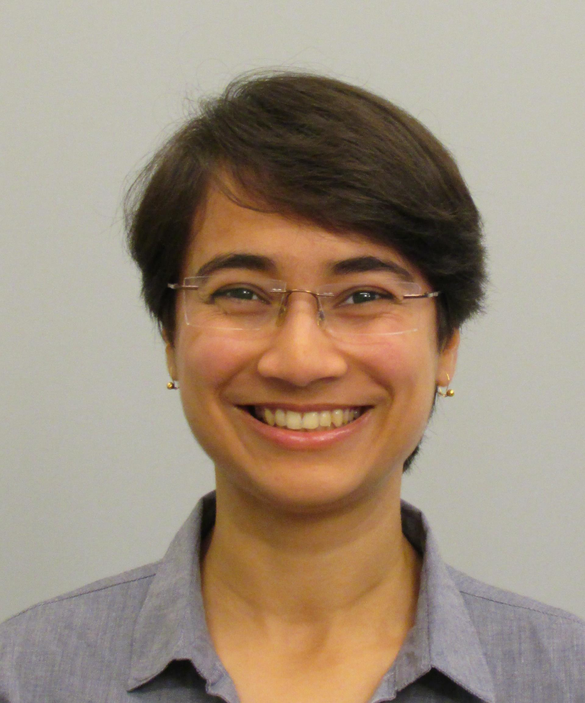

# Anvita Pant

{: style="width:500px; border-radius:50%;"}

**Location:** Rehovot, Israel  
**Institute:** Weizmann Institute of Science
**Lab:** [Clinical Cancer Proteomics](https://www.weizmann.ac.il/mcb/TGeiger/home)  
{: style="width:28px; margin:0 8px;"}[**Email**](anvita.pant@weizmann.ac.il)  
{: style="width:28px; margin:0 8px;"}[**Google Scholar**](https://scholar.google.com/citations?user=0D6QbOUAAAAJ&hl=en)  
{: style="width:28px; margin:0 8px;"}[**LinkedIn**](https://www.linkedin.com/in/anvita-pant/)   
{: style="width:28px; margin:0 8px;"}[**Github**](https://github.com/pantanvita)

---
  
## About Me

Hi, I am a PhD student at the Department of Molecular Cell Biology at the Weizmann Institute of Science under the supervision of [Prof. Tami Geiger](https://www.weizmann.ac.il/mcb/TGeiger/home).

With an academic foundation in Biotechnology, I have developed a keen interest in exploring the intricate signaling networks that regulate cancer heterogeneity. My long-term scientific interests lie at the interface of proteogenomics and cancer biology to enhance personalized medicine.

Apart from working in the lab, I enjoy swimming, playing badminton, reading fiction novels and hiking!

---

## Research

I am interested in studying the intra-tumor heterogeneity and interactions within the tumor microenvironment by employing spatial proteomics. This coupled with mass spectrometry-based proteomics will allow me to holistically investigate the spatial organization and the proteomic interplay between tumor and immune cells.

---
  
## Education

- **Ph.D. (2025- present):** Weizmann Institute of Science, Rehovot, Israel 
- **M.Sc. (2021- 2023):** Indian Institute of Technology Bombay (IIT-B), Mumbai, India

---
  
## Projects

- **Molecular and cellular characterization of Rab14 protein-dependent endocytic pathway-** University of Lausanne, Lausanne, Switzerland (Sept 2023- Sept 2024)  
  
- **Master's Thesis: Mass spectrometry-based Proteomics and Metabolomics analysis of Chemoresistance in Triple-Negative Breast Cancer (TNBC)-** Indian Institute of Technology Bombay, Mumbai, India (2022- 2023)

- **Identification of a cell surface receptor(s) needed for binding of a virus-like gene transfer agent, RcGTA, in the bacterium Rhodobacter capsulatus-** Univeristy of British Columbia (May 2022- July 2022)
  
---
  
## Publications

[1. **Unravelling the Mechanism of Cisplatin Resistance in Triple-Negative Breast Cancer: Insights from Metabolomic Profiling via Mass Spectrometry Analysis**](https://pubs.acs.org/doi/10.1021/jasms.4c00445)

Shashwati Parihari, **Anvita Pant**, Ankit Halder, and Sanjeeva Srivastava. Journal of the American Society for Mass Spectrometry **2025** *36*(6), 227-1240
[DOI:10.1021/jasms.4c00445](10.1021/jasms.4c00445)  

---

