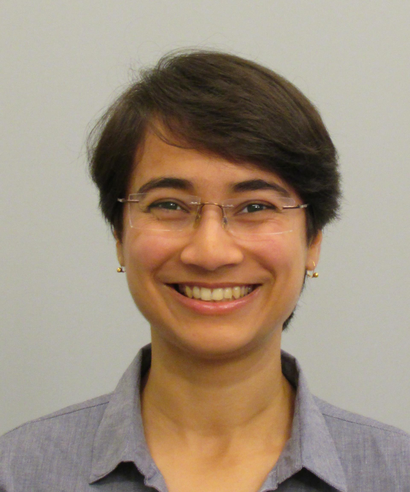

  
# Anvita Pant

{: style="width:200px; border-radius:50%;"}

  
**Location:** Rehovot, Israel  
**Institute:** Weizmann Institute of Science

**Lab:** [Clinical Cancer Proteomics](https://www.weizmann.ac.il/mcb/TGeiger/home)  
 [**Email**](anvita.pant@weizmann.ac.il)  
 [**Google Scholar**](https://scholar.google.com/citations?user=0D6QbOUAAAAJ&hl=en)  
 [**LinkedIn**](https://www.linkedin.com/in/anvita-pant/)   
 [Github](https://github.com/pantanvita)

---

  
## About Me

I am a PhD student at the Department of Molecular Cell Biology at the Weizmann Institute of Science under the supervision of [Prof. Tami Geiger]((https://www.weizmann.ac.il/mcb/TGeiger/home).
With an academic foundation in Biotechnology, I have developed a keen interest in exploring the intricate cellular signaling networks that regulate cancer heterogeneity and complexity. My long-term scientific interests lie at the interface of proteogenomics and cancer biology to enhance personalized medicine.

---

  
## Research

I am interested in studying the intra-tumor heterogeneity and interactions within the tumor microenvironment by employing spatial proteomics. This coupled with mass spectrometry-based proteomics will allow us to obtain a holistic and comprehensive understanding of the spatial organization and the proteomic interplay between tumor and immune cells.

---

  
## Education

- **Ph.D. (2025- present)** — [Weizmann Institute of Science]  
- **M.Sc. (2021- 2023)** — [Indian Institute of Technology Bombay (IIT-B)]

---

  
## Projects

- **University of Lausanne, Lausanne, Switzerland (Sept 2023- Sept 2024)** Molecular and cellular characterization of Rab14 protein-dependent endocytic pathway 
  
- **Master's Thesis (supervisor: Prof. Sanjeeva Srivastava), Indian Institute of Technology Bombay (2022- 2023)** Mass spectrometry-based Proteomics and Metabolomics analysis of Chemoresistance in Triple-Negative Breast Cancer (TNBC)

- **Univeristy of British Columbia (supervisor: Prof. J. Thomas Beatty) (May 2022- July 2022)** Identification of a cell surface receptor(s) needed for binding of a virus-like gene transfer agent, RcGTA, in the bacterium Rhodobacter capsulatus
  

---

  
## Publications

Unravelling the Mechanism of Cisplatin Resistance in Triple-Negative Breast Cancer: Insights from Metabolomic Profiling via Mass Spectrometry Analysis
(https://pubs.acs.org/action/showCitFormats?doi=10.1021/jasms.4c00445&ref=pdf)

---

